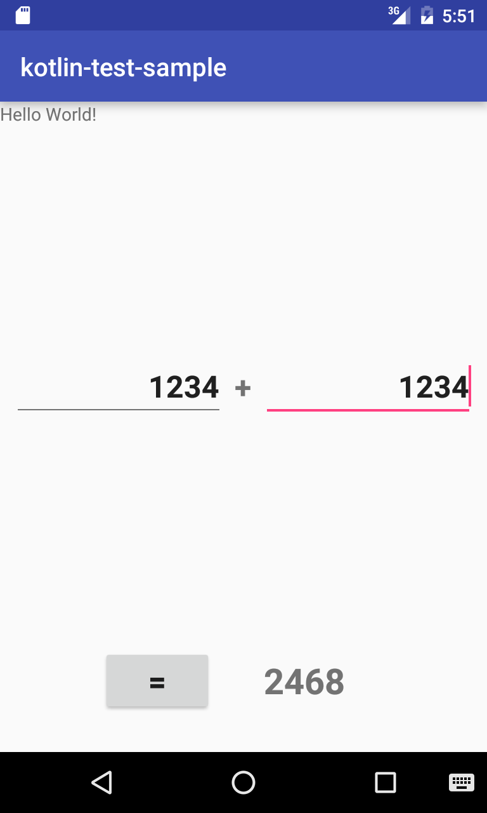
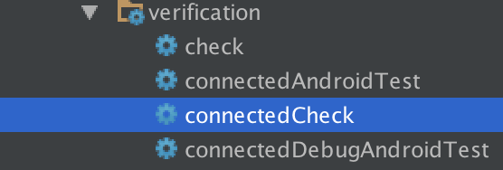
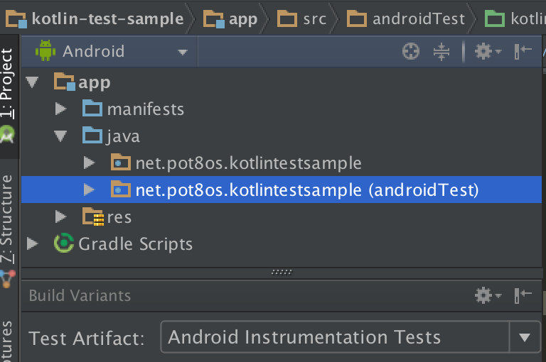
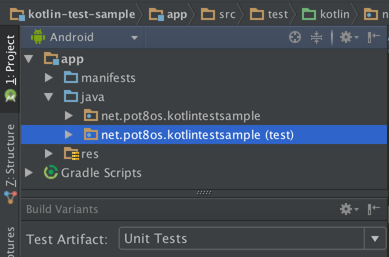

Kotlin-Espresso-Sample
===================================================

This is a simple project for Android Studio using [Kotlin](https://github.com/JetBrains/kotlin) and [Espresso](https://developer.android.com/intl/ja/tools/testing-support-library/index.html#Espresso). It also includes typical unit tests using JUnit4.

All codes are written in Kotlin.

## What you can learn from this repo

- How to implement UI tests using Espresso and logic tests using JUnit4
- Fundamental Kotlin language and basic usage
- Thanks to RxJava, we can implement a calculator by [less than 100 lines](https://github.com/pot8os/Kotlin-Espresso-sample/blob/master/app/src/main/kotlin/net/pot8os/kotlintestsample/MainActivity.kt)! :rocket:

## Library version

- Kotlin: 1.0.3
- Espresso: 2.2.2 (espresso-core)

## An app as a test target

Super very simple calculator.. :)

## Do tests

Note: You have to connect a device as test target in advance. Both of simulator and real one are good.

### Using Android Studio

|   |UI Test (use Espresso)|Logic Test (use JUnit4)|
|---|----------------------|-----------------------|
|gradle task|`connectedCheck`  |`testDebugUnitTest`  |
|corresponded `Test Artifact` in `Build Variants`|`Android Instrumentation Tests`  |`Unit Tests`  |
|path of test files|`src/androidTest/kotlin`|`src/test/kotlin`|
|prefix of dependencies in `build.gradle`|`androidTestCompile`|`testCompile`|

## License

MIT
