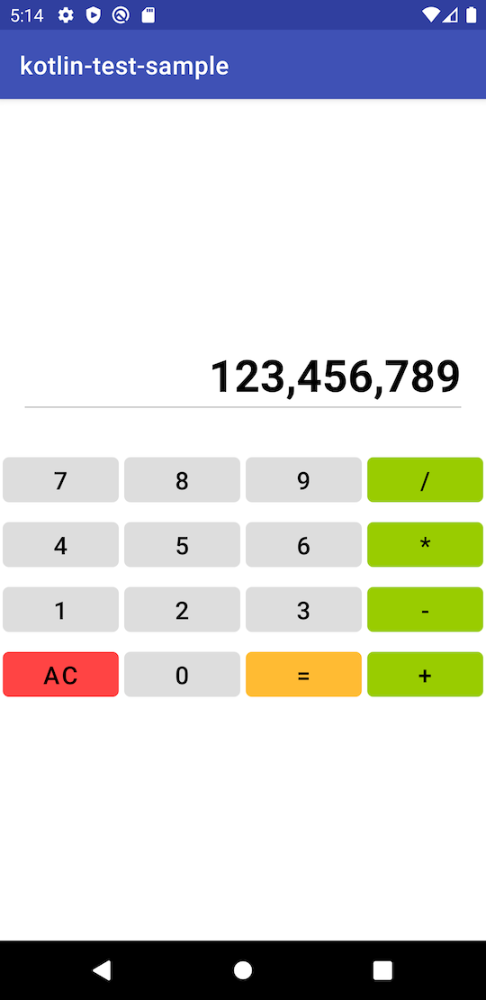
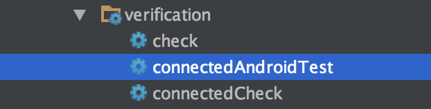
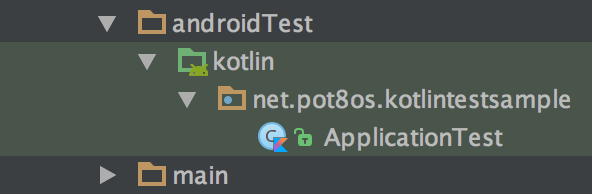
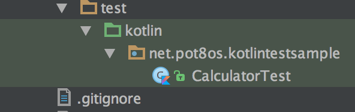

# Kotlin-Espresso-Sample

This is MVP project for Android app that is written in [Kotlin](https://github.com/JetBrains/kotlin) and uses [Espresso](https://developer.android.com/intl/ja/tools/testing-support-library/index.html#Espresso) to run both unit and instrumented tests.

## What you can learn from this project

- How to **share test cases** between `Instrumented tests` and `unit tests`
- Fundamental and practical methods that how to write Android code using [Android Architecture Components](https://developer.android.com/topic/libraries/architecture) that brings `ViewModel`.

## Requirements

- Run with Android Studio 3.5.3 (or newer)

## Target app

No need to explain about the app since you are familiar with this well.. :)

## Run tests

Requires a connected device to run `Instrumented tests`. It doesn't matter whether it's a simulator and a real one.

### Using Android Studio

|   |Instrumented Tests|Unit Tests|
|---|----------------------|-----------------------|
|Gradle task name|`connectedAndroidTest`  |`testDebugUnitTest`  |
|Location of test code|`src/androidTest/kotlin` |`src/test/kotlin` |

## License

MIT
